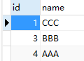

# 使用 Maven 构建工具搭建基于 SSM 架构的高效 JavaEE 企业级框架

## 一、创建 JavaWeb 工程
`mvn archetype:generate -DgroupId=your.package.name -DartifactId=project_name -DarchetypeArtifactId=maven-archetype-webapp`

## 二、引入 jar 包
* 在 `pom.xml` 中引入 `mysql-connector-java-5.1.38.jar` 的驱动包
* 在 `pom.xml` 中引入 `mybatis-3.2.8.jar` 的jar包

## 三、配置 MyBatis 相关

### 1、创建 mybatis-config.xml 的配置文件：

	<?xml version="1.0" encoding="UTF-8" ?>
	<!DOCTYPE configuration PUBLIC "-//mybatis.org//DTD Config 3.0//EN" "http://mybatis.org/dtd/mybatis-3-config.dtd">
	<configuration>
		<!-- 对事务的管理和连接池的配置，默认为开发模式[development|work] -->
		<environments default="development">
			<environment id="development">
				<!-- 事务提交类型[JDBC|MANAGED] -->
				<transactionManager type="JDBC" />
				<dataSource type="POOLED">
					<property name="driver" value="com.mysql.jdbc.Driver" />
					<property name="url" value="jdbc:mysql://127.0.0.1:3306/book" />
					<property name="username" value="root" />
					<property name="password" value="123456" />
				</dataSource>
			</environment>
		</environments>
		<!-- mapping 文件路径配置 -->
		<mappers>
			<!-- 测试基于代码直接调用的方式 -->
			<mapper resource="cn/cuilan/oldbooks/mybatis/simple/demoMapper.xml" />
			<!-- 测试基于注解的方式 -->
			<mapper class="cn.cuilan.oldbooks.mybatis.annotations.DemoMapper" />
		</mappers>
	</configuration>

### 2、创建数据库测试表：

	CREATE TABLE `demo` (
	  `id` int(11) NOT NULL AUTO_INCREMENT,
	  `name` varchar(20) DEFAULT NULL,
	  PRIMARY KEY (`id`)
	); ENGINE=InnoDB AUTO_INCREMENT=1 DEFAULT CHARSET=utf8

### 3、在 test 包下创建测试用例
* 创建 `src/test/java/cn.cuilan.xxx.mybatis.entity.Demo.java` 实体
* 创建 `src/test/java/cn.cuilan.xxx.mybatis.util.MyBatisUtils.java` 工具类

	public class MyBatisUtils {
		/**
		 * 获取SqlSessionFactory
		 * 
		 * @return 返回SqlSessionFactory
		 * @throws IOException
		 */
		public static SqlSessionFactory getSqlSessionFactory() {
			// 定义配置文件
			String resource = "mybatis/mybatis-config.xml";
			// 加载 mybatis 的配置文件（它也加载关联的映射文件）
			Reader reader;
			try {
				reader = Resources.getResourceAsReader(resource);
			} catch (IOException e) {
				throw new RuntimeException("获取配置文件异常！");
			}
			// 构建 sqlSession 的工厂
			SqlSessionFactory sessionFactory = new SqlSessionFactoryBuilder().build(reader);
			return sessionFactory;
		}
	}

* 基于代码直接调用 xml 的基本方式进行测试
* 基于注解调用接口的方式进行测试

### 4、优化&配置 SQL 日志

* 在  mybatis-config.xml 配置文件中为映射实体类指定简单名称（可选方案）

	<!-- 指定别名 -->
	<typeAliases>
		<!-- 指定单个实体类 -->
		<!-- <typeAlias type="cn.cuilan.oldbooks.mybatis.entity.Demo" alias="Demo" 
			/> -->
		<!-- 指定某个包下所有的实体类 -->
		<package name="cn.cuilan.oldbooks.mybatis.entity" />
	</typeAliases>
	
* 在 `pom.xml` 中引入 `log4j-1.2.17.jar` 的jar包

	# 设置
	log4j.rootLogger = DEBUG,stdout
	# 显示基本信息并输出信息到控制台
	log4j.appender.stdout = org.apache.log4j.ConsoleAppender
	log4j.appender.stdout.Target = System.out
	log4j.appender.stdout.layout = org.apache.log4j.PatternLayout
	log4j.appender.stdout.layout.ConversionPattern = [%-5p] - [%d{yyyy-MM-dd HH:mm:ss}] %l - %m%n
	# 配置SQL相关
	log4j.logger.java.sql.ResultSet = DEBUG
	log4j.logger.org.apache = DEBUG
	log4j.logger.java.sql.Connection = DEBUG
	log4j.logger.java.sql.Statement = DEBUG
	log4j.logger.java.sql.PreparedStatement = DEBUG

### 5、配置 MyBatis 缓存

#### 5.1、配置 MyBatis 一级缓存

MyBatis 一级缓存为 session 级别的缓存，默认情况下为开启状态，只有当以下三种情况下会导致 session 缓存失效
* 执行了 `session.clearCache();` 操作
* 执行了 CUD 操作
* 不是同一个 session 对象范围内的数据库查询操作

#### 5.2、配置 MyBatis 二级缓存

* 配置二级缓存只需要在映射文件中加 `<cache />` 标签即可
* 高级配置

	<cache 
		eviction="LRU"
		flushInterval="60000"
		size="512"
		readOnly="false" />

`eviction`:[`LRU`:最近最少使用算法|`FIFO`:先进先出算法]

`flushInterval`:刷新时间

`size`:缓存引用的数目

`eadOnly`:是否只读[`true`|`false`(默认)]

## 四、Spring 整合 MyBatis

### 1、引入 Spring

* 在 `pom.xml` 中引入 `spring-context-4.3.2.RELEASE.jar` 的jar包

* 在 `pom.xml` 中引入 `spring-tx-4.3.2.RELEASE.jar` 的jar包

* 在 `pom.xml` 中引入 `spring-jdbc-4.3.2.RELEASE.jar` 的jar包

* 在 `pom.xml` 中引入 `spring-test-4.3.2.RELEASE.jar` 的jar包

* 自动导入依赖

`spring-core-4.3.2.RELEASE.jar`

`spring-beans-4.3.2.RELEASE.jar`

`spring-aop-4.3.2.RELEASE.jar`

`spring-expression-4.3.2.RELEASE.jar`

`commons-logging-1.2.jar`

### 2、引入 mybatis-spring

* 在 `pom.xml` 中引入 `mybatis-spring-1.2.2.RELEASE.jar` 的jar包

